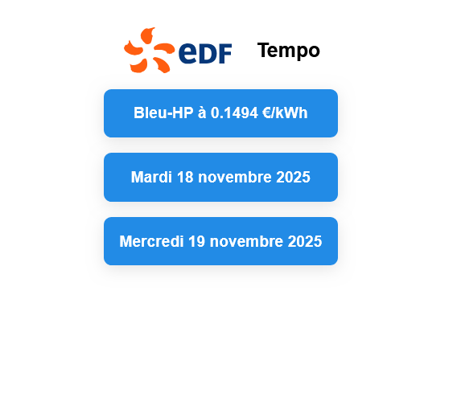

# EDF Tempo Visualisation

Ce projet affiche les informations quotidiennes et tarifaires Tempo d’EDF en temps réel via leurs API, avec une interface simple et colorée.
Fonctionnalités

- Affiche le logo EDF avec le libellé "Tempo"

- Récupère et affiche la couleur pour aujourd’hui et demain en français

- Affiche le tarif actuel avec une couleur d’arrière-plan dynamique

- Mise en forme claire avec CSS et date en français formatée

# Screenshot

# Au choix:

- Avec bash
- Page html avec du js
  

# Merci pour l'api 
https://www.api-couleur-tempo.fr/api/now     
    

# À propos des logos et marques

Les logos et marques restent la propriété exclusive de leur propriétaire.

Ce projet n’est pas affilié à Électricité de France (EDF) ni approuvé par celle-ci.

